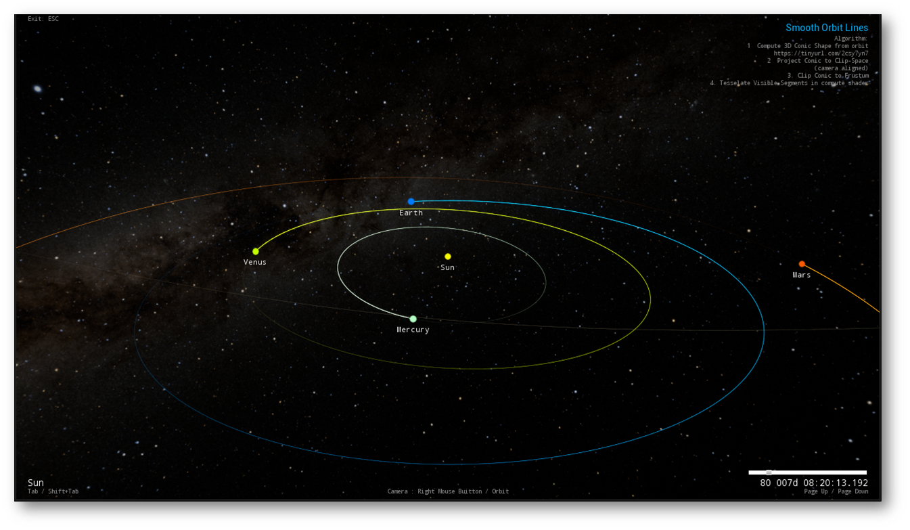

# OrbitPerspectiveProjection
The perspective projection of a conic section is another conic section.  This UE5 Sample tessellates orbit lines in screen space from the *projected* conic equation.

Projecting the conic equation onto the frustum render plane allows orbital lines to be tessellated in screen space to an exact equation of the conic.  This minimizes any tessellation artifacts by "delaying" and bounding any discrete sampling of the conic equation until GPU Clip Space tessellation.

This is just a sample app (working implementation) not intended for more than demonstrating the algorithm.

A production implementation would tessellate in a compute shader, freeing the CPU from any interaction during the rendering process (other than setting a True Anomaly state in a shader constant perhaps).  This is a CPU implementation that uses David Eberly's Geometric Tools library for vector math.  (There are no MaxQ/CSPICE plugin dependencies)

See [Perspectively Projecting Orbits](PerspectivelyProjectingOrbits.pptx) for more info.

